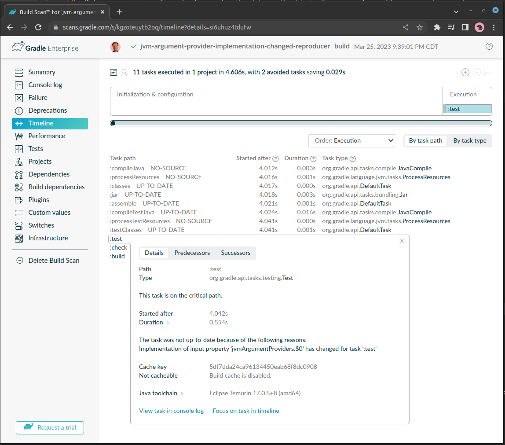

# jvm-argument-provider-implementation-changed-reproducer

## Steps to reproduce

1. Run `./gradlew build`
2. Make an insignificant change to `build.gradle.kts`. For example, add a comment somewhere.
3. Run `./gradlew build --scan` and agree to the terms of service.
4. On Build Scan Timeline you will see that `:test` has re-executed.
5. Example Build Scan: https://scans.gradle.com/s/kgzoteuytb2oq/timeline?details=si6uhuz4tdufw

